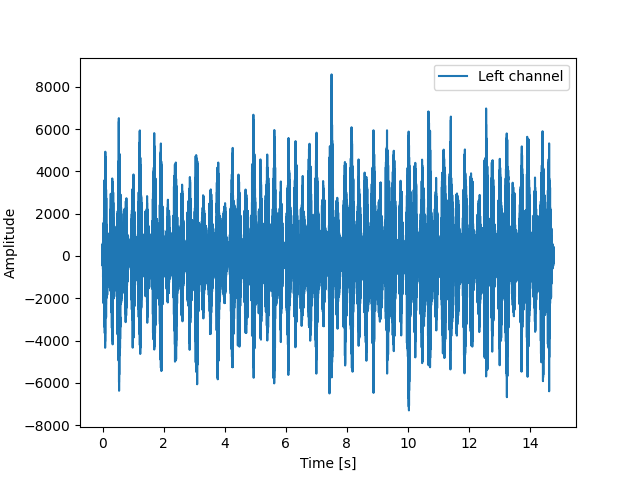
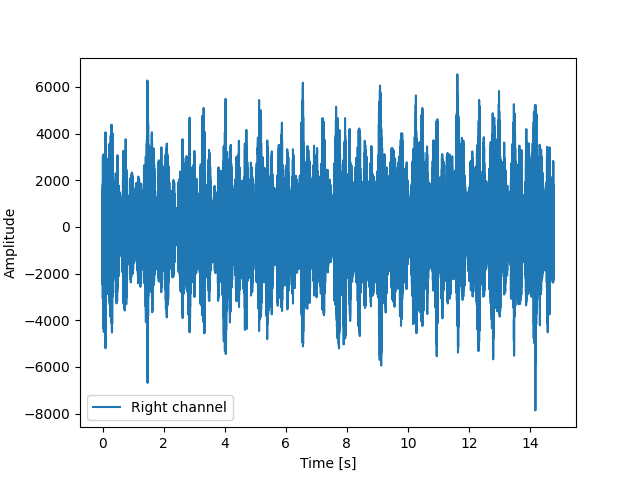
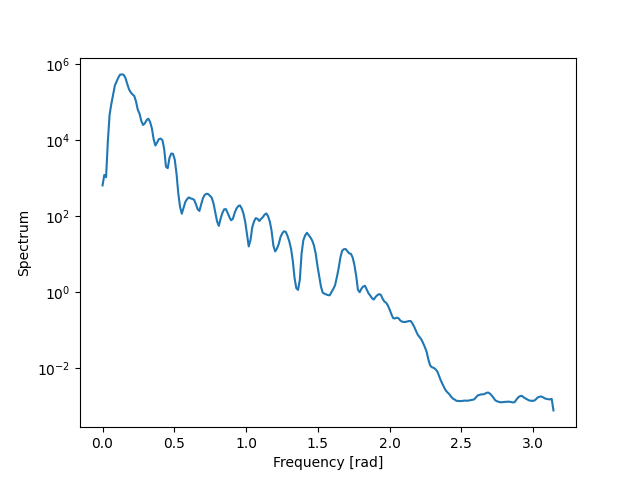
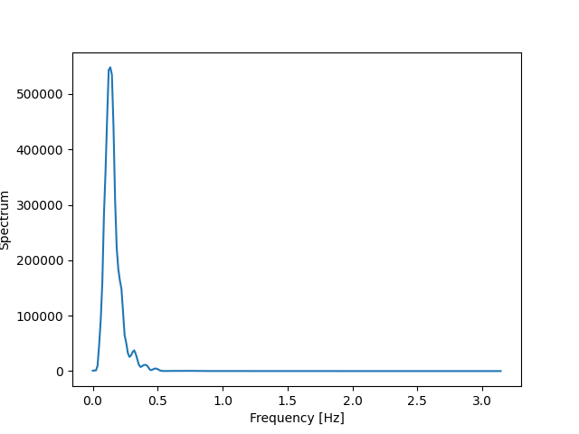
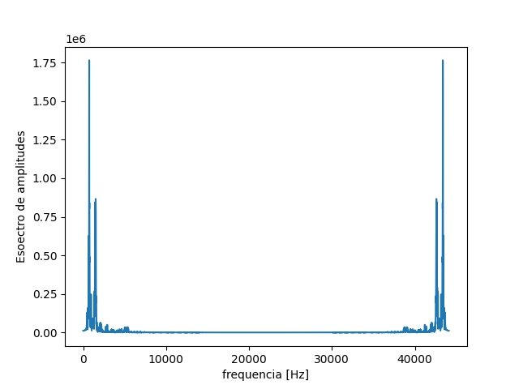

# Vizualização do conteúdo espectral de um arquivo de áudio

O script análisado abaixo pode ser executado utilizando o arquivo **spectrum_welch.py** juntamente com o áudio **581010__xcreenplay__smoking-in-the-angel-section2.wav** presente na pasta assets.

Primeiramente importamos as bibliotecas necessárias.

```py
import numpy as np
import matplotlib.pyplot as plt

from scipy.io import wavfile
from scipy.signal import welch
from scipy import fftpack
```

Após importarmos as bibliotecas que serão utilizadas, carregamos o arquivo de áudio.

```py
# Load audio file
samplerate, data = wavfile.read('./assets/581010__xcreenplay__smoking-in-the-angel-section2.wav')

# Loads the file in two channels (stereo audio)
print(f"number of channels = {data.shape[1]}") # => number of channels = 2

# Total time = number of samples / fs
length = data.shape[0] / samplerate
print(f"duration = {length}s") # => duration = 14.76922902494331s
```
A seguir, plotamos as figuras no domínio do tempo.

```py
# Plot the figures over time
# Interpolate to determine time axis
time = np.linspace(0., length, data.shape[0])

# Plots the left and right channels
plt.figure(1)
plt.plot(time, data[:, 0], label="Left channel")
plt.legend()
plt.xlabel("Time [s]")
plt.ylabel("Amplitude")
plt.show()

plt.figure(2)
plt.plot(time, data[:, 1], label="Right channel")
plt.legend()
plt.xlabel("Time [s]")
plt.ylabel("Amplitude")
plt.show()
```

| Left channel | Right channel |
|:-------------:|:-------------:|
 | |
|||

Para plotar o conteúdo espectral, utilizaremos a função [*welch*](https://docs.scipy.org/doc/scipy/reference/generated/scipy.signal.welch.html).

```py
# Estimates the signal spectrum using the welch function
x  = data[:, 0] # => left channel
fs = 2*np.pi
# fs = samplerate
f, Pxx_spec = welch(x, fs, 'flattop', 512, scaling='spectrum')
```

A seguir, podemos vizualizar o conteúdo espectral do sinal no intervalo $0$ e $\pi$.

```py
# Plots the signal spectrum for normalized frequencies between 0 1 pi (positive frequencies)

plt.figure(3)
plt.semilogy(f, Pxx_spec)
plt.xlabel('Frequency [rad]')
plt.ylabel('Spectrum')
plt.show()
```

<p align='center'>
  
</p>

**Exemplo de modulação:**

```py
# Frequency of the generated cosine function
f_c = 10000 #10KHz
T = 1/f_c

# Number of input file samples
ns = data.shape[0]

# Initializing arrays to collect 1s of data
cosseno  = [0]*ns
t_axis = np.arange(0., ns)*T

# Cosine function that will be used in the modulation
for i in range(ns):
    cosseno[i] = np.cos(2 * np.pi * f_c * i * T) 

#Estimates the signal spectrum using the welch function
x  = data[:, 0]*cosseno # => left channel
fs = 2*np.pi
f, Pxx_spec = welch(x, fs, 'flattop', 512, scaling='spectrum')

plt.figure(4)
plt.plot(f, Pxx_spec)
plt.xlabel('Frequency [Hz]')
plt.ylabel('Spectrum')
plt.show()
```

<p align='center'>
  
</p>

## Plota espectro utilizando função FFT

Não utilizamos, nesse momento, a transformada rápida de Fourier (FFT, do inglês Fast Fourier Transform). Porém, abaixo está um exemplo de como realizar a mostragem do spectrum utilizanddo FFT.

```py
# Plot spectrum using FFT function
nfft=4096
freq = np.linspace(0., samplerate, nfft) # Interpolate to determine frequency axis
sig_fft = fftpack.fft(x,nfft)
plt.figure(4)
plt.plot(freq, np.abs(sig_fft))
plt.xlabel('Frequency [Hz]')
plt.ylabel('Amplitude spectrum')
plt.show()
```

<p align='center'>
  
</p>

## Informações Adicionais

### Processamento digital de sinais (PDS) em python

O livro Think DSP trata de forma didática o processamento digital de sinais, usando exemplos de implementação em Python. O livro pode ser baixado ou visualizado online no site:

* [greenteapress.com](https://greenteapress.com/wp/think-dsp/)

O livro Think DSP faz uso da biblioteca *SciPy*, que contém um conjunto de funções
largamente utilizadas em PDS. Pode-se consultar as funções pertencentes a esta biblioteca em:

* [docs.scipy.org](https://docs.scipy.org/doc/scipy/reference/signal.html)

---

Outras fontes de consulta para aplicações de PDS podem ser os cursos disponibilizados na plataforma Coursera, em:

* [coursera.org - dsp1#syllabus](https://www.coursera.org/learn/dsp1#syllabus)
* [coursera.org - dsp2#reviews](https://www.coursera.org/learn/dsp2#reviews)

### Banco de dados de sinais de áudio

Uma das aplicações mais clássicas de PDS é o processamento de sinais digitais de áudio. Para se testar algoritmos de PDS, é possível encontrar diversos arquivos de áudio em formato digital no site:

* [freesound](https://freesound.org/browse/)

Para baixar algum destes sinais, deve-se criar um usuário no site, o que pode ser feito de forma bem simples.