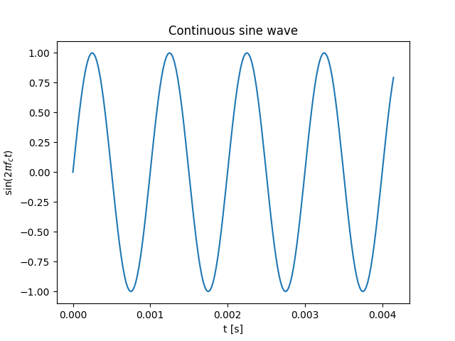
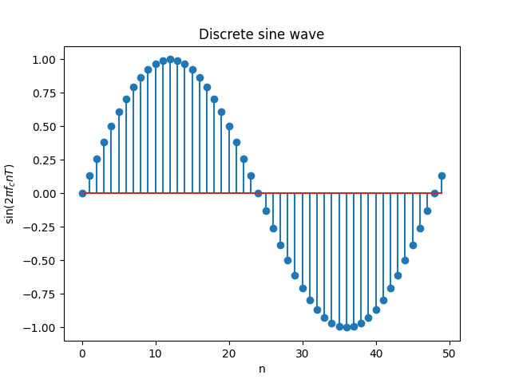

# Geração e visualização de uma senóide discreta

A primeira coisa que devemos fazer é importar/carregar as bibliotecas que utilizaremos em nosso código (script). Dentre as bibliotecas mais comuns da linguagem Python, destacam-se: [*Matplotlib*](https://matplotlib.org/stable/index.html), [*NumPy*](https://numpy.org/) e [*SciPy*](https://docs.scipy.org/doc/scipy/reference/index.html).

```py
import matplotlib.pyplot as plt # For plotting
from math import sin, pi # => For generating input signals
import numpy as np
```

A seguir, definimos algumas características do sinal que criaremos (senóide discreta).

```py
# Frequency of the generated sine function
f_c = 1000 # => 1KHz

# Sampling period
fs = 48000 # => Sampling frequency = 48KHz
T = 1/fs

# Number of samples in 1s
ns = fs*1
```
Para criar a senóide discreta, utlizamos um *loop* computacional.

```py
# Initializing arrays to collect 1s of data
input_data  = [0]*ns
t_axis = np.arange(0., ns)*T

# Sine function sampled up to 1s
for i in range(ns):
    input_data[i] = sin(2 * pi * f_c * i * T) 

```
Vamos agora visualizar uma representação (*aproximada*) do que seria a senóide contínua.

```py
# Select sine samples: #1/100 of 1s
n_plot=200
t_plot = t_axis[0:n_plot] 
input_section = input[0:n_plot] 

# Plot of the continuous sine function (plot function "simulates" a continuous function)
plt.figure(1)                
plt.ylabel('sin($2\pi f_c t$)')
plt.xlabel('t [s]') 
plt.title('Sinusoid continues')      
plt.plot(t_plot,input_section)
plt.show()
```
<p align='center'>
  
</p>

Esta senóide não é de fato contínua, pois ela está sendo representada em um computador de forma discreta. A função *plot* apenas cria uma linha contínua através da interpolação dos pontos da senóide discreta.

Uma vizualização mais fiel da senóide discreta armazenda na memória do computador pode ser feita com o uso da função *stem*.

```py
# Select sine samples
n_plot=50
t_plot = t_axis[0:n_plot] 
input_section = input[0:n_plot] 

# Plot of the sine function sampled with fs = 48KHz
plt.figure(2)                
plt.ylabel('sen($2\pi f_c n T$)')
plt.xlabel('n') 
plt.title('Discrete sine wave')      
plt.stem(input_section)
plt.show()
```

<p align='center'>
  
</p>